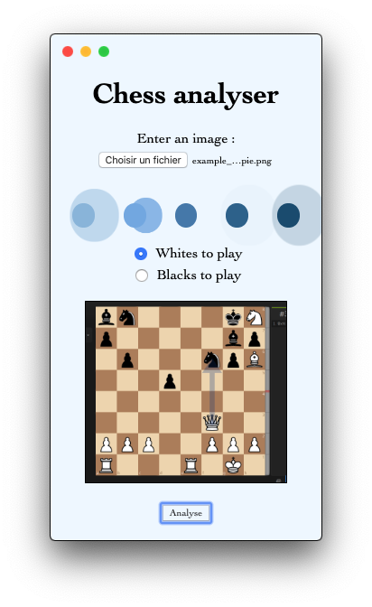

# ChessApp
 An [ElectronJS](https://www.electronjs.org/) GUI that recognize a chess position from a screenshot and return the best move.

# Dependencies

First, run the following command to install all dependencies : 
```
$ sh installation/requirements.sh
```
Then: 
```
$ npm start
```

# Preview

|  |  |  |  |
|:-------------:|:-------------:|:-------------:|:-------------:|
|**First State** <br> (Select File & Player)|**Image Loaded**|**Computing...**|**Here is the result !**|

# License
[MIT](https://choosealicense.com/licenses/mit/) License

# Acknowledgement

This project is strongly supported by [Elucidation/tensorflow_chessbot](https://github.com/Elucidation/tensorflow_chessbot) and [jhlywa/chess.js](https://github.com/jhlywa/chess.js)
