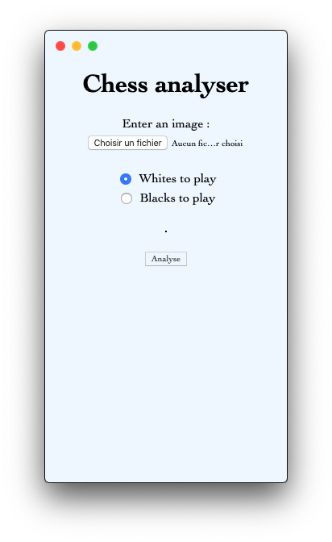
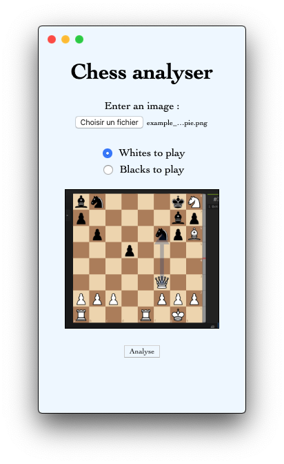
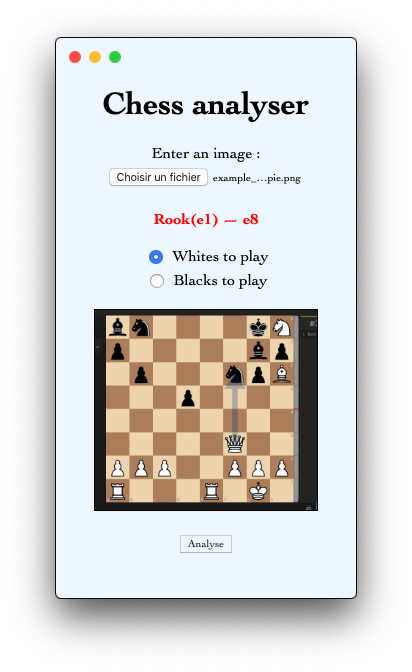

# ChessApp
 An [ElectronJS](https://www.electronjs.org/) GUI that recognize a chess position from a screenshot and return the best move.

# Dependencies

First, run the following command to install all dependencies : 
```
$ sh installation/requirements.sh
```
Then: 
```
$ npm start
```

# Preview

|  |  |  |
|----------|:-------------:|------:|
|&nbsp;&nbsp;&nbsp;&nbsp;&nbsp;&nbsp;&nbsp;&nbsp;*First State*|*Image Loaded*|*Here is the result !*&nbsp;&nbsp;&nbsp;&nbsp;&nbsp;&nbsp;&nbsp;&nbsp;|

# License
[MIT](https://choosealicense.com/licenses/mit/) License
